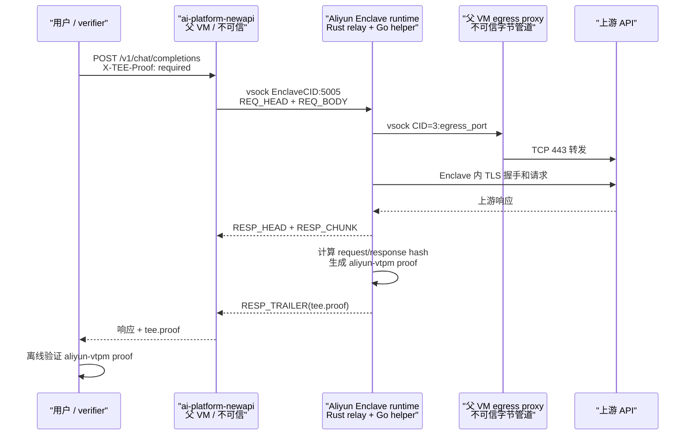

# ai-platform-newapi 接入阿里云 Enclave 部署 Runbook

日期：2026-07-17

本文记录如何把本地 `ai-platform-newapi` 作为不可信 Relay Adapter，部署在阿里云 Enclave 父 VM 上，并接入 `proof-of-observation` 的阿里云 `aliyun-vtpm` Enclave runtime，完成：

- 用户请求进入 `ai-platform-newapi`；
- `ai-platform-newapi` 通过 vsock 把请求交给 Enclave；
- Enclave 内终结上游 TLS、请求真实上游 API、流式返回响应；
- Enclave 生成 `aliyun-vtpm` `tee.proof`；
- 用户侧 verifier 用阿里云 TPM CA、PCR allowlist、nonce、请求/响应 hash 验证 proof。

## 1. 当前结论

`ai-platform-newapi` 当前代码已经具备接入阿里云 Enclave runtime 的基础能力：

- 已实现 `TEE Relay Frame Protocol v1`：
  - `REQ_HEAD`
  - `REQ_BODY`
  - `RESP_HEAD`
  - `RESP_CHUNK`
  - `RESP_TRAILER`
- 已能向 Enclave 发送：
  - `nonce`
  - `egress_port`
  - `upstream.host`
  - `upstream.method`
  - `upstream.path`
  - `upstream.headers`
  - bearer token
- 已支持 OpenAI-compatible `chat.completions`：
  - 非流式：返回 `multipart/mixed`，其中包含上游响应和 `tee.proof`；
  - 流式：在 SSE 末尾追加 `event: tee.proof`。
- 已支持 proof sidecar：
  - `GET /api/tee/proofs/:proof_id`
  - 需要 read-only token 鉴权；
  - 当前第一阶段仅支持进程内 memory store。

当前限制：

- 只覆盖 OpenAI-compatible `chat.completions`。
- 通道配置如果启用会改写响应的选项，例如 `ForceFormat`、`ThinkingToContent`，proof 路径会拒绝启用。
- 非流式 proof 响应会改变 HTTP response transport 为 `multipart/mixed`；客户端必须支持该响应格式。
- 流式 proof 要求响应最终形成完整 SSE event boundary，否则不会追加 proof。
- `ai-platform-newapi` 不做阿里云 evidence 验证；真正 verifier 在用户侧或独立验证服务中执行。
- `TEE_PROOF_EXPECTED_PCR0` 是 AWS Nitro 历史命名，在阿里云链路里只作为响应头元数据透出，不是信任判断依据。阿里云信任判断以 verifier trust bundle 中的 PCR8/PCR9/PCR11 和阿里云 TPM CA 链为准。
- 当前 `ai-platform-newapi` 自己生成 proof nonce。该模式可用于链路验证和 response-only 验证，但还不是“最终用户/verifier 发起挑战 nonce”的完整生产形态。生产要支持用户 nonce 新鲜性，需要让 `ai-platform-newapi` 接收用户侧 nonce header，并把它透传到 Enclave `REQ_HEAD.nonce`。
- 当前 `TEE_PROOF_ENABLED=true` 后，OpenAI-compatible chat JSON 请求会默认要求 proof。该行为适合专用 proof 实例；如果同一 `new-api` 实例还承载其它普通上游，必须先做启用范围隔离，否则可能误伤非 proof 流量。

## 2. 链路图



关键点：

- `ai-platform-newapi` 和父 VM egress proxy 都不可信。
- 上游 TLS 必须在 Enclave 内终结。
- `egress_port` 不是上游 HTTPS 端口，而是父 VM 上给 Enclave 连接的 vsock egress 端口。
- 父 VM egress proxy 只提供字节转发；它可以断开、延迟、丢包，但不能生成有效 proof。

## 2.1 安全边界和生产前提

### proof 启用范围

当前 `ai-platform-newapi` 的 proof 判断逻辑是“只要 `TEE_PROOF_ENABLED=true`，符合 OpenAI-compatible `chat.completions`、JSON、raw passthrough 条件的请求就会默认要求 proof”。这意味着：

- 如果请求上游 host 没有出现在 `TEE_PROOF_ALLOWED_HOSTS` 中，请求会被拒绝，而不是自动走普通路径。
- 如果请求上游 host 没有配置对应 `TEE_PROOF_EGRESS_PORTS`，请求会被拒绝。
- 如果同一 `new-api` 实例同时服务 proof 上游和普通上游，开启 `TEE_PROOF_ENABLED=true` 可能影响普通 OpenAI chat 流量。

推荐部署方式：

- 第一阶段使用 **专用 proof 实例**：只配置需要 proof 的 channel 和上游 host。
- 如果必须共用同一个 `new-api` 实例，需要先改造 `ai-platform-newapi`：
  - 增加只在 `X-TEE-Proof: required` 时启用 proof 的模式；或
  - 增加按 channel / model / route 开启 proof 的配置；或
  - 确保所有 OpenAI chat 上游都配置了 allowlist 和 egress proxy。

### nonce 新鲜性

当前 `ai-platform-newapi` proof client 在调用 Enclave 前生成随机 nonce，并写入 `REQ_HEAD.nonce`。这可以证明：

- proof 中的 quote challenge 和 statement 绑定了某个本次请求 nonce；
- replay 旧 proof 时，如果 verifier 使用 proof 内部 nonce 之外的外部期望 nonce，会失败。

但当前链路还不能证明：

- nonce 是最终用户/verifier 在请求前发起的挑战；
- relay 没有自行选择 nonce 后再把 proof 返回给用户。

因此本文的测试步骤默认属于“relay-generated nonce 链路验证”。生产如果要求用户侧 freshness，需要扩展 `ai-platform-newapi`：

```text
用户/verifier -> ai-platform-newapi: X-TEE-Nonce: <base64 32-byte nonce>
ai-platform-newapi -> Enclave: REQ_HEAD.nonce = <same nonce>
用户/verifier: verify --nonce-b64 <same nonce>
```

在完成该改造前，用户侧 verifier 可以验证 quote、PCR、证书链、host、响应 hash 和 full bundle 请求绑定，但不能把“nonce 由最终用户挑战产生”作为已经满足的生产保证。

### query/header 覆盖范围

当前 `tee-exchange-v2` statement 继承原版 proof-of-observation 的兼容边界，主要覆盖：

- nonce；
- upstream host；
- upstream path 的 path 部分；
- HTTP method；
- HTTP status；
- response content-type；
- request body SHA-256；
- response body SHA-256。

第一阶段不要声称 proof 已完整覆盖所有 query string 和请求 header 语义。生产接入时必须在 Relay Adapter / `ai-platform-newapi` 层做策略约束：

- 如果 query string 会影响上游语义，应固定或只允许明确 allowlist。
- 如果 header 会影响模型、工具、beta feature、响应格式、vendor routing，应固定、拒绝用户覆盖，或后续升级 proof profile，把 header/query 摘要纳入 signed statement。
- Authorization token 可以由 Enclave 使用，但 token 本身不应出现在 proof 或日志中。

## 3. 代码和分支

### 3.1 proof-of-observation

仓库：

```text
https://github.com/Demo-9876/proof-of-observation
```

分支：

```text
feature/aliyun-vtpm-evidence-profile
```

关键目录：

```text
deploy/aliyun-vtpm-runtime/Dockerfile
deploy/aliyun-vtpm-runtime/run.sh
aliyun-enclave/
enclave/
verifier/
docs/evidence-profile-aliyun-vtpm.md
docs/aliyun-enclave-current-deployment-runbook.md
docs/aliyun-enclave-streaming-relay-design.md
```

### 3.2 ai-platform-newapi

本地路径：

```text
/Users/admin/Documents/code/go/code.shihuo.cn/aibrain/ai-platform-newapi
```

当前本地分支：

```text
qianxing01/feature/1329073/proof_qx
```

关键文件：

```text
relay/proof/config.go
relay/proof/client.go
relay/proof/protocol.go
relay/proof/eligibility.go
relay/proof/endpoint.go
relay/proof/passthrough.go
relay/proof/store.go
relay/channel/api_request.go
relay/compatible_handler.go
controller/tee_proof.go
router/api-router.go
```

部署到阿里云机器前，先确认本地改动已经提交并推送：

```bash
cd /path/to/ai-platform-newapi
git status --short --branch
git push origin qianxing01/feature/1329073/proof_qx
```

如果阿里云机器无法直接访问代码仓库，可以在可访问内网 Git 的机器构建镜像，再推到阿里云 ACR，由阿里云机器只负责 `docker pull`。

## 4. 父 VM 基础准备

以下命令以 Alibaba Cloud Linux 2 / 类 CentOS 环境为例。

### 4.1 安装基础工具

```bash
sudo yum install -y git jq openssl tar gzip xz wget curl
```

如果机器没有 Docker：

```bash
sudo yum install -y docker
sudo systemctl enable docker
sudo systemctl start docker
sudo docker version
```

如果机器没有 `enclave-cli`，需要先按阿里云 Enclave 文档安装。已有安装时检查：

```bash
sudo enclave-cli --version || true
sudo enclave-cli describe-enclaves
```

如果已有旧 Enclave 在运行，应先确认是否可以终止：

```bash
sudo enclave-cli describe-enclaves

sudo enclave-cli terminate-enclave \
  --enclave-id <OLD_ENCLAVE_ID>
```

### 4.2 准备 socat-vsock

父 VM 需要一个可用的 `socat-vsock`，用于 egress proxy。

检查当前目录是否已有：

```bash
find ~ -name socat-vsock -type f 2>/dev/null
```

设置变量：

```bash
export SOCAT_VSOCK=/path/to/socat-vsock
file "$SOCAT_VSOCK"
chmod +x "$SOCAT_VSOCK"
```

注意：

- `/path/to/socat-vsock` 是占位符，必须替换成真实路径。
- 如果当前机器没有 `socat-vsock`，需要从之前测试目录复制、从可信构建环境上传，或用等价 vsock proxy 实现替代。

## 5. 部署阿里云 Enclave runtime

### 5.1 拉取代码

```bash
cd ~

git clone https://github.com/Demo-9876/proof-of-observation.git
cd proof-of-observation
git fetch origin feature/aliyun-vtpm-evidence-profile
git switch feature/aliyun-vtpm-evidence-profile
```

如果 HTTPS 拉取失败，可改用 SSH，但需要先配置 GitHub SSH key：

```bash
ssh -T git@github.com
git clone git@github.com:Demo-9876/proof-of-observation.git
```

### 5.2 构建 runtime 镜像

```bash
cd ~/proof-of-observation

sudo docker build --network host \
  -f deploy/aliyun-vtpm-runtime/Dockerfile \
  -t proof-of-observation-aliyun-vtpm:latest \
  .
```

如果 Docker Hub 拉取慢或失败，需要把 Dockerfile 中 builder/base image 提前同步到可访问的镜像仓库，或在有公网访问的环境构建后推送到 ACR。注意 final runtime base 必须是 Debian bookworm 系或其它 glibc/libstdc++ 兼容镜像；不要用 Alibaba Cloud Linux 2 / glibc 2.17 作为 final runtime，否则 `/attest` 会因 `GLIBC_2.xx not found` 启动失败，Enclave 内不会监听 `5005/5006`。

在阿里云父 VM 上使用 ACR 镜像和国内网络源构建时，可显式传入：

```bash
export ACR_REGISTRY=<your-acr-registry>
export ACR_NAMESPACE=<your-namespace>

sudo docker build --network host \
  -f deploy/aliyun-vtpm-runtime/Dockerfile \
  --build-arg GO_BUILDER_IMAGE="$ACR_REGISTRY/$ACR_NAMESPACE/golang:amd64-sha256-98d673f18a1aac43da744209873cb79323e11706f909251bcfb131828b95559d" \
  --build-arg GO_MODULE_PROXY=https://goproxy.cn,direct \
  --build-arg GO_SUMDB=sum.golang.google.cn \
  --build-arg RUST_BUILDER_IMAGE="$ACR_REGISTRY/$ACR_NAMESPACE/rust:amd64-sha256-64d9b7f60e3abb08d477cad983d0a3743acc53a19369ba4482510184c9c807e5" \
  --build-arg RUNTIME_IMAGE="$ACR_REGISTRY/$ACR_NAMESPACE/debian:bookworm-slim" \
  --build-arg APT_MIRROR=https://mirrors.aliyun.com/debian \
  --build-arg APT_SECURITY_MIRROR=https://mirrors.aliyun.com/debian-security \
  --build-arg CARGO_REGISTRY_PROTOCOL=sparse \
  --build-arg CARGO_REGISTRY_REPLACE_WITH=rsproxy-sparse \
  --build-arg CARGO_REGISTRY_MIRROR=sparse+https://rsproxy.cn/index/ \
  -t proof-of-observation-aliyun-vtpm:latest \
  .
```

### 5.3 构建 EIF 并记录 PCR

```bash
cd ~/proof-of-observation

sudo enclave-cli build-enclave \
  --docker-dir . \
  --docker-uri proof-of-observation-aliyun-vtpm:latest \
  --output-file aliyun-vtpm-runtime.eif \
  | tee build-measurements.log
```

保存输出里的 PCR：

```bash
cat build-measurements.log
```

当前阿里云 `aliyun-vtpm` verifier 主要使用：

```text
sha256:8
sha256:9
sha256:11
```

注意：

- 每次修改 Dockerfile、Rust 代码、Go helper、依赖、base image、构建工具版本，都必须重新记录 PCR。
- debug mode 下 measurements 全零，不能用于生产信任。

### 5.4 启动 Enclave

```bash
cd ~/proof-of-observation

sudo enclave-cli run-enclave \
  --cpu-count 2 \
  --memory 2048 \
  --eif-path aliyun-vtpm-runtime.eif
```

记录输出里的 `EnclaveCID`，例如：

```text
"EnclaveCID": 4
```

检查状态：

```bash
sudo enclave-cli describe-enclaves
```

预期看到：

```text
"State": "RUNNING"
```

## 6. 启动父 VM egress proxy

假设目标上游为 DashScope OpenAI-compatible endpoint：

```text
dashscope.aliyuncs.com:443
```

约定父 VM egress vsock port：

```text
8444
```

启动 egress proxy：

```bash
mkdir -p ~/proof-of-observation/logs

sudo "$SOCAT_VSOCK" -d -d \
  vsock-listen:8444,reuseaddr,fork \
  TCP:dashscope.aliyuncs.com:443 \
  > ~/proof-of-observation/logs/egress-dashscope-8444.log 2>&1 &

echo $! | tee ~/proof-of-observation/logs/egress-dashscope-8444.pid
```

检查进程：

```bash
ps -ef | grep socat-vsock | grep 8444
tail -f ~/proof-of-observation/logs/egress-dashscope-8444.log
```

生产或长时间联调不建议只用后台 `&` 启动。可以用 systemd 托管，以下示例假设 `socat-vsock` 已放在 `/opt/tee/bin/socat-vsock`：

```bash
sudo mkdir -p /opt/tee/bin
sudo cp "$SOCAT_VSOCK" /opt/tee/bin/socat-vsock
sudo chmod 0755 /opt/tee/bin/socat-vsock

sudo tee /etc/systemd/system/tee-egress-dashscope.service >/dev/null <<'EOF'
[Unit]
Description=TEE egress proxy for dashscope.aliyuncs.com
After=network-online.target
Wants=network-online.target

[Service]
Type=simple
ExecStart=/opt/tee/bin/socat-vsock -d -d vsock-listen:8444,reuseaddr,fork TCP:dashscope.aliyuncs.com:443
Restart=always
RestartSec=2

[Install]
WantedBy=multi-user.target
EOF

sudo systemctl daemon-reload
sudo systemctl enable --now tee-egress-dashscope.service
sudo systemctl status tee-egress-dashscope.service --no-pager
journalctl -u tee-egress-dashscope.service -f
```

如果有多个上游 host，每个 host 建议使用独立 egress port：

```bash
sudo "$SOCAT_VSOCK" -d -d \
  vsock-listen:8445,reuseaddr,fork \
  TCP:api.openai.com:443 \
  > ~/proof-of-observation/logs/egress-openai-8445.log 2>&1 &
```

然后在 `ai-platform-newapi` 中配置：

```text
TEE_PROOF_EGRESS_PORTS=dashscope.aliyuncs.com:8444,api.openai.com:8445
```

## 7. 部署 ai-platform-newapi

推荐两种方式：

- 推荐生产方式：在有内网依赖访问能力的 CI / 构建机上构建镜像，推送到 ACR，父 VM 只拉镜像运行。
- 调试方式：在阿里云父 VM 上直接拉源码构建。

### 7.1 推荐：使用已构建镜像运行

在构建机上构建并推送：

```bash
cd /path/to/ai-platform-newapi

DOCKER_BUILDKIT=1 docker build \
  --network host \
  --secret id=gitkey,src=$HOME/.ssh/id_rsa \
  -t <acr-registry>/<namespace>/ai-platform-newapi:aliyun-proof \
  .

docker push <acr-registry>/<namespace>/ai-platform-newapi:aliyun-proof
```

在阿里云父 VM 上拉取：

```bash
sudo docker pull <acr-registry>/<namespace>/ai-platform-newapi:aliyun-proof
```

运行 `new-api`：

```bash
export ENCLAVE_CID=<RUN_ENCLAVE_OUTPUT_CID>

sudo docker run -d \
  --name ai-platform-newapi \
  --restart always \
  --network host \
  --security-opt seccomp=unconfined \
  -v ~/new-api-data:/data \
  -v ~/new-api-logs:/app/logs \
  -e TZ=Asia/Shanghai \
  -e READ_CONFIG=false \
  -e SQL_DSN='<your-sql-dsn>' \
  -e REDIS_CONN_STRING='<your-redis-conn-string>' \
  -e SESSION_SECRET='<random-session-secret>' \
  -e NODE_NAME=aliyun-enclave-parent-1 \
  -e TEE_PROOF_ENABLED=true \
  -e TEE_PROOF_REQUIRE=true \
  -e TEE_PROOF_ENCLAVE_CID="$ENCLAVE_CID" \
  -e TEE_PROOF_ENCLAVE_PORT=5005 \
  -e TEE_PROOF_ALLOWED_HOSTS=dashscope.aliyuncs.com \
  -e TEE_PROOF_EGRESS_PORTS=dashscope.aliyuncs.com:8444 \
  -e TEE_PROOF_TIMEOUT_SECONDS=300 \
  -e TEE_PROOF_MAX_BODY_BYTES=67108864 \
  -e TEE_PROOF_STORE=memory \
  -e TEE_PROOF_STORE_TTL_SECONDS=600 \
  -e TEE_PROOF_STORE_MAX_ITEMS=10000 \
  -e TEE_PROOF_EXPECTED_PCR0='' \
  <acr-registry>/<namespace>/ai-platform-newapi:aliyun-proof \
  --log-dir /app/logs
```

说明：

- `--network host` 简化父 VM 上的端口访问和排查。
- `--security-opt seccomp=unconfined` 用于避免 Docker 默认 seccomp 拦截 `AF_VSOCK`。如果容器仍不能创建 vsock socket，可改用宿主机二进制部署，或按最小权限方式放行 `socket(AF_VSOCK, ...)`。
- `TEE_PROOF_EXPECTED_PCR0` 在阿里云链路里不是 verifier trust source，可留空。真实 PCR allowlist 在用户侧 trust JSON 配置。

### 7.2 调试：在阿里云父 VM 上源码构建

安装 git：

```bash
sudo yum install -y git
git --version
```

拉取代码：

```bash
cd ~
git clone <ai-platform-newapi-git-url> ai-platform-newapi
cd ai-platform-newapi
git fetch origin qianxing01/feature/1329073/proof_qx
git switch qianxing01/feature/1329073/proof_qx
```

构建镜像：

```bash
cd ~/ai-platform-newapi

DOCKER_BUILDKIT=1 sudo docker build \
  --network host \
  --secret id=gitkey,src=$HOME/.ssh/id_rsa \
  -t ai-platform-newapi:aliyun-proof \
  .
```

如果构建失败，常见原因：

- 无法拉取公司内网基础镜像：
  - `shihuo-acr-registry-vpc.cn-hangzhou.cr.aliyuncs.com/shihuo-base/bun:v1.0`
  - `shihuo-acr-registry-vpc.cn-hangzhou.cr.aliyuncs.com/shihuo-base/golang:1.26-alpine-gov1`
  - `shihuo-acr-registry-vpc.cn-hangzhou.cr.aliyuncs.com/shihuo-base/debian:v1.0`
- 无法访问私有 Go module：
  - `code.shihuo.cn/go/hms-components`
  - `code.shihuo.cn/go/ratelimiter-redis-memory`
- Docker BuildKit secret 未传入正确 SSH key。
- 阿里云父 VM 没有到内网 Git / ACR 的网络权限。

这种情况下不要在父 VM 上继续硬调构建环境，建议改为“构建机打镜像 + ACR 分发”。

## 8. new-api proof 相关配置说明

| 变量 | 示例 | 说明 |
| --- | --- | --- |
| `TEE_PROOF_ENABLED` | `true` | 总开关。 |
| `TEE_PROOF_REQUIRE` | `true` | proof 失败时不降级，直接返回错误。生产验证建议设为 `true`。 |
| `TEE_PROOF_ENCLAVE_CID` | `4` | `sudo enclave-cli run-enclave` 输出的 `EnclaveCID`。 |
| `TEE_PROOF_ENCLAVE_PORT` | `5005` | Enclave runtime 的 relay 端口。当前固定为 `5005`。 |
| `TEE_PROOF_ALLOWED_HOSTS` | `dashscope.aliyuncs.com` | 允许走 proof 的上游 host 白名单。 |
| `TEE_PROOF_EGRESS_PORTS` | `dashscope.aliyuncs.com:8444` | 上游 host 到父 VM egress vsock port 的映射。 |
| `TEE_PROOF_TIMEOUT_SECONDS` | `300` | 调 Enclave 和读写 frame 超时时间。 |
| `TEE_PROOF_MAX_BODY_BYTES` | `67108864` | 最大请求体和响应体限制。 |
| `TEE_PROOF_STORE` | `memory` | 当前仅支持 `memory`。 |
| `TEE_PROOF_STORE_TTL_SECONDS` | `600` | sidecar proof 过期时间。 |
| `TEE_PROOF_STORE_MAX_ITEMS` | `10000` | memory store 最大 proof 数。 |
| `TEE_PROOF_EXPECTED_PCR0` | 空字符串 | 历史 AWS Nitro 命名，仅响应头元数据，不用于阿里云 verifier。 |

重要：当前代码中 `TEE_PROOF_ENABLED=true` 不是“仅当请求头带 `X-TEE-Proof: required` 才启用 proof”。它会让符合条件的 OpenAI chat JSON 请求默认走 proof eligibility，并在 host / egress 不满足时拒绝请求。生产推荐把 proof 流量放到专用 `new-api` 实例或专用 channel；如果要混部普通流量，需要先补代码级开关或把所有可能命中的上游都配置完整。

通道配置要求：

- 使用 OpenAI-compatible `chat.completions`。
- 上游 host 必须命中 `TEE_PROOF_ALLOWED_HOSTS`。
- 上游 host 必须在 `TEE_PROOF_EGRESS_PORTS` 中找到 egress port。
- 请求 `Content-Type` 必须包含 `application/json`。
- 请求体必须有可确定的 `Content-Length`，且不超过 `TEE_PROOF_MAX_BODY_BYTES`。
- 通道不得启用会改写响应的配置：
  - `ForceFormat`
  - `ThinkingToContent`
- 流式请求建议显式开启 usage：

```json
{
  "stream": true,
  "stream_options": {
    "include_usage": true
  }
}
```

## 9. 准备 verifier trust bundle

### 9.1 下载阿里云 TPM CA

```bash
mkdir -p ~/proof-of-observation/trust/aliyun-tpm-ca
cd ~/proof-of-observation/trust/aliyun-tpm-ca

curl -fsSLO https://aliyun-tpm-ca.oss-cn-beijing.aliyuncs.com/pki001/root-ca.crt
curl -fsSLO https://aliyun-tpm-ca.oss-cn-beijing.aliyuncs.com/pki001/ekmf-ca.crt

openssl x509 -in root-ca.crt -noout -fingerprint -sha256 -subject -issuer
openssl x509 -in ekmf-ca.crt -noout -fingerprint -sha256 -subject -issuer
```

已校准样本中的指纹：

```text
root-ca.crt:
870d6e888c3531b69983f0aebb7b9802aa097065ae01a825913ad398ce96252f

ekmf-ca.crt:
141805f04cd9b89bfbcd30cb792d5ca3a0a2382db6ee35720e6e27e4189e43a0
```

### 9.2 生成 trust JSON

从 `build-measurements.log` 中填入 PCR8/PCR9/PCR11：

```json
{
  "profile": "aliyun-vtpm",
  "expectedPcrs": {
    "sha256:8": "<PCR8_FROM_BUILD_MEASUREMENTS>",
    "sha256:9": "<PCR9_FROM_BUILD_MEASUREMENTS>",
    "sha256:11": "<PCR11_FROM_BUILD_MEASUREMENTS>"
  },
  "requirePlatformTrust": true,
  "platformTrust": {
    "mode": "cert-chain",
    "rootCertificatesPem": [
      "<root-ca.crt PEM content>"
    ],
    "intermediateCertificatesPem": [
      "<ekmf-ca.crt PEM content>"
    ],
    "rootFingerprintsSha256": [
      "870d6e888c3531b69983f0aebb7b9802aa097065ae01a825913ad398ce96252f"
    ],
    "intermediateFingerprintsSha256": [
      "141805f04cd9b89bfbcd30cb792d5ca3a0a2382db6ee35720e6e27e4189e43a0"
    ],
    "enclaveSubjectCnPattern": "^i-[A-Za-z0-9][A-Za-z0-9-]*-enclave-[0-9]+$",
    "revocation": {
      "required": false,
      "checkedExternally": false
    }
  }
}
```

不建议手写多行 PEM 字符串。可以用 `jq --rawfile` 生成真实 JSON：

```bash
cd ~/proof-of-observation

export PCR8=<PCR8_FROM_BUILD_MEASUREMENTS>
export PCR9=<PCR9_FROM_BUILD_MEASUREMENTS>
export PCR11=<PCR11_FROM_BUILD_MEASUREMENTS>

mkdir -p trust

jq -n \
  --arg pcr8 "$PCR8" \
  --arg pcr9 "$PCR9" \
  --arg pcr11 "$PCR11" \
  --rawfile root trust/aliyun-tpm-ca/root-ca.crt \
  --rawfile ekmf trust/aliyun-tpm-ca/ekmf-ca.crt \
  '{
    profile: "aliyun-vtpm",
    expectedPcrs: {
      "sha256:8": $pcr8,
      "sha256:9": $pcr9,
      "sha256:11": $pcr11
    },
    requirePlatformTrust: true,
    platformTrust: {
      mode: "cert-chain",
      rootCertificatesPem: [$root],
      intermediateCertificatesPem: [$ekmf],
      rootFingerprintsSha256: [
        "870d6e888c3531b69983f0aebb7b9802aa097065ae01a825913ad398ce96252f"
      ],
      intermediateFingerprintsSha256: [
        "141805f04cd9b89bfbcd30cb792d5ca3a0a2382db6ee35720e6e27e4189e43a0"
      ],
      enclaveSubjectCnPattern: "^i-[A-Za-z0-9][A-Za-z0-9-]*-enclave-[0-9]+$",
      revocation: {
        required: false,
        checkedExternally: false
      }
    }
  }' > trust/aliyun-vtpm-trust.json

jq . trust/aliyun-vtpm-trust.json
```

生产前建议：

- 接入 CRL 检查或外部 appraiser；
- 如果要求强制吊销检查，不能长期保持 `revocation.required=false`。

## 10. 发送测试请求

以下示例假设：

```bash
export NEW_API_BASE=http://127.0.0.1:7070
export NEW_API_TOKEN=<your-new-api-token>
```

### 10.1 非流式请求

```bash
cat > /tmp/tee-request.json <<'EOF'
{
  "model": "qwen-plus",
  "messages": [
    {
      "role": "user",
      "content": "用一句话解释什么是远程证明"
    }
  ],
  "stream": false
}
EOF

curl -sS \
  "$NEW_API_BASE/v1/chat/completions" \
  -H "Authorization: Bearer $NEW_API_TOKEN" \
  -H "Content-Type: application/json" \
  -H "X-TEE-Proof: required" \
  -D /tmp/tee-response.headers \
  --data-binary @/tmp/tee-request.json \
  -o /tmp/tee-response.multipart
```

检查响应头：

```bash
cat /tmp/tee-response.headers
file /tmp/tee-response.multipart
```

预期：

```text
Content-Type: multipart/mixed; boundary=<proof_id>
X-TEE-Proof-Version: 2
X-TEE-Proof-Id: <proof_id>
X-TEE-Proof-Upstream-Host: dashscope.aliyuncs.com
```

获取 proof sidecar：

```bash
PROOF_ID=$(
  awk -F': ' 'tolower($1)=="x-tee-proof-id"{gsub("\r","",$2); print $2}' \
    /tmp/tee-response.headers
)

curl -sS \
  "$NEW_API_BASE/api/tee/proofs/$PROOF_ID" \
  -H "Authorization: Bearer $NEW_API_TOKEN" \
  | jq . > /tmp/tee-proof-sidecar.json

jq '.proof.profile, .proof.evidence.profile' /tmp/tee-proof-sidecar.json
```

预期：

```text
"aliyun-vtpm"
"aliyun-vtpm"
```

### 10.2 流式请求

```bash
cat > /tmp/tee-stream-request.json <<'EOF'
{
  "model": "qwen-plus",
  "messages": [
    {
      "role": "user",
      "content": "用三句话解释什么是远程证明"
    }
  ],
  "stream": true,
  "stream_options": {
    "include_usage": true
  }
}
EOF

curl -N \
  "$NEW_API_BASE/v1/chat/completions" \
  -H "Authorization: Bearer $NEW_API_TOKEN" \
  -H "Content-Type: application/json" \
  -H "Accept: text/event-stream" \
  -H "X-TEE-Proof: required" \
  -D /tmp/tee-stream.headers \
  --data-binary @/tmp/tee-stream-request.json \
  -o /tmp/tee-stream.sse
```

检查 SSE 尾部：

```bash
tail -n 40 /tmp/tee-stream.sse
grep -n "event: tee.proof" /tmp/tee-stream.sse
```

预期能看到：

```text
event: tee.proof
data: {"v":2,"profile":"aliyun-vtpm",...}
```

## 11. 用户侧 verifier 验证

verifier 不要求运行在阿里云父 VM 上。它可以运行在用户本地、CI、审计机或任意能拿到响应 capture / proof / trust bundle 的现代 Linux/macOS 环境。

注意：

- Alibaba Cloud Linux 2 的 glibc 版本较老，新版官方 Node 二进制可能无法运行。
- 如果必须在父 VM 上运行 verifier，建议使用已验证兼容的 Node 版本，或直接使用 Node 容器。
- 不要把 verifier 能否在父 VM 上运行，和 Enclave proof 链路是否成立混在一起判断。

进入 verifier 目录：

```bash
cd ~/proof-of-observation/verifier
npm ci
```

### 11.1 response-only 验证

`tee-verify-stream.ts` 可以解析：

- SSE response + 尾部 `event: tee.proof`
- `multipart/mixed` response capture

示例：

```bash
npx tsx tee-verify-stream.ts \
  /tmp/tee-stream.sse \
  --trust ~/proof-of-observation/trust/aliyun-vtpm-trust.json \
  --host dashscope.aliyuncs.com
```

非流式 multipart capture：

```bash
npx tsx tee-verify-stream.ts \
  /tmp/tee-response.multipart \
  --trust ~/proof-of-observation/trust/aliyun-vtpm-trust.json \
  --host dashscope.aliyuncs.com
```

如果已经完成用户 nonce 透传改造，并且请求前由 verifier 生成了 nonce，则增加：

```bash
--nonce-b64 "$EXPECTED_NONCE_B64"
```

如果使用当前未改造的 `ai-platform-newapi`，nonce 由 relay 生成。此时不要把 `--nonce-b64 "$(从 proof 里读出的 nonce)"` 当作生产新鲜性验证；那只能做一致性排查，不能证明 nonce 是用户预先挑战。

说明：

- response-only 验证能证明用户收到的响应 bytes 和 proof 中 `response_body_sha256` 匹配。
- response-only 验证不包含请求体绑定。要证明“答的就是我这条请求”，需要使用 full bundle 验证。

### 11.2 full bundle 验证

构造 full bundle 需要：

- 原始请求体 bytes；
- 用户收到的上游响应 bytes；
- `tee.proof` JSON。

bundle 格式：

```json
{
  "requestBody_b64": "<base64 request body bytes>",
  "responseBody_b64": "<base64 response body bytes without tee.proof>",
  "proof": {
    "...": "tee.proof json"
  }
}
```

可以用 verifier 内部解析器从 capture 构造 full bundle。以下脚本同时支持：

- 非流式 `multipart/mixed` capture，例如 `/tmp/tee-response.multipart`；
- 流式 SSE capture，例如 `/tmp/tee-stream.sse`。

```bash
cd ~/proof-of-observation/verifier

cat > build-tee-full-bundle.tmp.ts <<'EOF'
import { readFileSync, writeFileSync } from 'node:fs';
import { parseTeeProofCapture } from './tee-verify-core.ts';

const [, , requestPath, capturePath, outPath] = process.argv;
if (!requestPath || !capturePath || !outPath) {
  console.error('usage: tsx build-tee-full-bundle.tmp.ts <request.json> <captured-response> <out-bundle.json>');
  process.exit(2);
}

const requestBody = readFileSync(requestPath);
const capture = readFileSync(capturePath);
const parsed = parseTeeProofCapture(capture);
if (!parsed.proof) {
  console.error('tee.proof not found in captured response');
  process.exit(1);
}

writeFileSync(outPath, JSON.stringify({
  requestBody_b64: requestBody.toString('base64'),
  responseBody_b64: parsed.body.toString('base64'),
  proof: parsed.proof,
}, null, 2));
EOF

npx tsx build-tee-full-bundle.tmp.ts \
  /tmp/tee-request.json \
  /tmp/tee-response.multipart \
  /tmp/tee-full-bundle.json

jq '.proof.profile, (.responseBody_b64 | length)' /tmp/tee-full-bundle.json
```

如果要用流式 capture 构造 bundle，把第二个参数换成 `/tmp/tee-stream.sse`，第一个参数换成对应的流式请求体：

```bash
cd ~/proof-of-observation/verifier

npx tsx build-tee-full-bundle.tmp.ts \
  /tmp/tee-stream-request.json \
  /tmp/tee-stream.sse \
  /tmp/tee-stream-full-bundle.json

rm -f build-tee-full-bundle.tmp.ts
```

验证命令：

```bash
npx tsx verify-real-bundle.ts \
  /tmp/tee-full-bundle.json \
  --trust ~/proof-of-observation/trust/aliyun-vtpm-trust.json \
  --host dashscope.aliyuncs.com
```

如果请求前由用户/verifier 生成并透传了 nonce，则增加：

```bash
--nonce-b64 "$EXPECTED_NONCE_B64"
```

生产集成建议：

- 普通用户可先走 response-only 验证；
- 对需要审计“请求绑定”的场景，客户端或中转站适配层应保存原始请求体和剥离 proof 后的响应体，生成 full bundle。

## 12. 排障

### 12.1 `TEE proof required but request is not eligible`

检查：

```bash
docker logs ai-platform-newapi --tail 200
```

常见原因：

- `TEE_PROOF_ENABLED=false`
- `TEE_PROOF_ENCLAVE_CID` 未设置；
- `TEE_PROOF_ALLOWED_HOSTS` 不包含真实上游 host；
- `TEE_PROOF_EGRESS_PORTS` 缺少真实上游 host；
- 请求不是 OpenAI-compatible `chat.completions`；
- `Content-Type` 不是 `application/json`；
- 通道配置启用了会改写响应的选项。

### 12.2 `vsock dialer is only available on linux`

说明 `new-api` 不是跑在 Linux build tag 的二进制上，或在非 Linux 环境执行。

处理：

- 在阿里云 Linux 父 VM 上运行；
- 使用 Linux 镜像或 Linux 二进制；
- 不要在 macOS 本地直接跑完整 vsock 链路。

### 12.3 容器里无法连接 Enclave

如果 `new-api` 跑在 Docker 容器里，可能是 Docker 默认 seccomp 阻止 `AF_VSOCK`。

处理：

```bash
sudo docker rm -f ai-platform-newapi

sudo docker run ... \
  --network host \
  --security-opt seccomp=unconfined \
  ...
```

如果仍失败，改为宿主机直接运行 `new-api` 二进制验证。

### 12.4 Enclave 连接上游失败

检查 egress proxy：

```bash
ps -ef | grep socat-vsock | grep 8444
tail -n 200 ~/proof-of-observation/logs/egress-dashscope-8444.log
```

检查 `TEE_PROOF_EGRESS_PORTS` 是否和 egress proxy port 一致：

```bash
echo "$TEE_PROOF_EGRESS_PORTS"
```

确认 `egress_port` 是父 VM vsock port，不是 `443`。

### 12.5 verifier PCR 不匹配

检查：

```bash
cat ~/proof-of-observation/build-measurements.log
cat ~/proof-of-observation/trust/aliyun-vtpm-trust.json
```

常见原因：

- trust JSON 里的 PCR 不是当前 EIF 的 PCR；
- 重新构建过 Docker image / EIF，但没有更新 trust JSON；
- 使用 debug mode 启动，导致 measurements 全零；
- verifier 使用了旧 trust bundle。

### 12.6 `QuoteReport.Cert` 证书链失败

检查：

- trust JSON 是否包含阿里云 root/intermediate PEM；
- root/intermediate SHA-256 pin 是否正确；
- `enclaveSubjectCnPattern` 是否匹配真实 `QuoteReport.Cert` subject CN。

可以从 proof 中提取证书：

```bash
jq -r '.proof.evidence.quote_report.cert_b64' /tmp/tee-proof-sidecar.json \
  | base64 -d > /tmp/QuoteReport.Cert.der

openssl x509 -inform DER -in /tmp/QuoteReport.Cert.der -out /tmp/QuoteReport.Cert.pem
openssl x509 -in /tmp/QuoteReport.Cert.pem -noout -subject -issuer -serial -fingerprint -sha256
```

真实阿里云 Enclave CN 形态示例：

```text
i-bp124j9zt94mo16k7bu2-enclave-1
```

### 12.7 非流式客户端不兼容 `multipart/mixed`

当前非流式 proof transport 会返回 `multipart/mixed`，不是单纯 OpenAI JSON。

处理方式：

- 客户端适配 multipart；
- 或优先用流式模式，解析 SSE 尾部 `event: tee.proof`；
- 或后续为业务定义独立 proof sidecar transport，但必须保证用户收到的响应 bytes 和 proof 覆盖的 response hash 一致。

## 13. 最小验收清单

部署完成后，至少确认：

- `sudo enclave-cli describe-enclaves` 显示 Enclave `RUNNING`。
- `EnclaveCID` 和 `TEE_PROOF_ENCLAVE_CID` 一致。
- egress proxy 进程在父 VM 上监听对应 vsock port。
- `new-api` 启动日志无 proof 配置错误。
- 非流式请求返回：
  - `Content-Type: multipart/mixed`
  - `X-TEE-Proof-Version: 2`
  - `X-TEE-Proof-Id`
  - proof JSON 中 `profile=aliyun-vtpm`
- 流式请求尾部存在：
  - `event: tee.proof`
  - proof JSON 中 `profile=aliyun-vtpm`
- verifier 使用 `aliyun-vtpm` trust bundle 验证通过：
  - QuoteReport.Cert 链；
  - quote signature；
  - challenge；
  - PCR digest；
  - PCR8/PCR9/PCR11 allowlist；
  - Ed25519 statement signature；
  - response hash；
  - full bundle 场景下 request hash。
