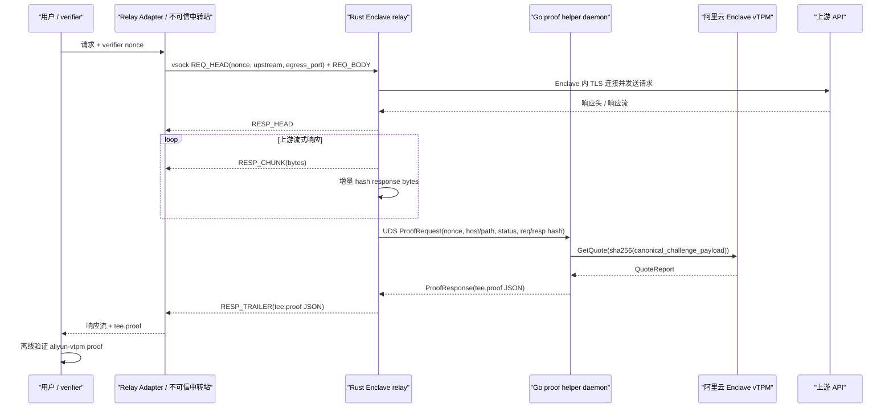

# 阿里云 Enclave 内完整 streaming relay 技术方案

日期：2026-07-16

本文描述如何把已经校准通过的 `aliyun-vtpm` proof 生成逻辑接入完整 Enclave streaming relay。目标是让阿里云 Enclave 版本具备和当前 AWS Nitro 版本同等的产品闭环：Enclave 内终结上游 TLS、流式转发真实上游响应、增量计算哈希，并在流末返回可离线验证的 `tee.proof`。

## 1. 当前结论

已经完成并验证的部分：

- `aliyun-enclave/internal/proof.GenerateFromHashes` 可以基于请求/响应 SHA-256、nonce、上游信息和状态信息生成 `tee-exchange-v2` proof。
- `aliyun-enclave/internal/attester` 可以在真实阿里云 Enclave 内通过官方 SDK 生成 vTPM `QuoteReport`。
- Node verifier 已通过真实阿里云 Enclave fixture 校准，能验证：
  - `QuoteReport.Cert` 链到阿里云 TPM root / EKMF intermediate；
  - EK CN 匹配 Enclave vTPM 形态，例如 `i-bp124j9zt94mo16k7bu2-enclave-1`；
  - `QuoteReport.Quoted` 的 `TPM2B_ATTEST` 包装；
  - TPM quote signature、challenge、PCR digest、PCR8/PCR9/PCR11 allowlist；
  - nonce、Ed25519 statement signature、request hash、response hash。

尚未完成的部分：

- 当前真实验证是 fixture，不是真实用户请求流。
- Rust Enclave relay 仍走 AWS Nitro NSM attestation 生成 trailer。
- 本文定义通用 Relay Adapter 标准接入方式，让任意不可信中转站都能按标准把用户请求送入 Enclave、把 proof 返回给用户。
- `ai-platform-newapi` 已经具备一套可复用的父 VM frame 协议和 stream 追加 `tee.proof` 能力，可作为标准 Relay Adapter 的示例实现，但不是本方案的唯一中转站。
- TypeScript verifier 暂未内置 CRL 解析；第一阶段生产前可通过外部 appraiser 完成 CRL 检查，或先保持 `revocation.required=false`。

## 2. 方案选择

采用 **Go helper daemon + 现有 Rust streaming relay**。

分工如下：

```text
Relay Adapter / 不可信中转站
  运行在父 VM 或其它不可信基础设施中。
  把用户请求映射为标准 TEE Relay Frame Protocol v1。
  只负责连接编排、字节转发、proof transport，不生成或修改 proof。

Rust Enclave relay
  监听标准 relay frame 连接。
  继续在 Enclave 内连接上游、终结 TLS、校验证书。
  继续流式发送 RESP_HEAD / RESP_CHUNK。
  继续增量计算 request_body_sha256 / response_body_sha256。
  流末调用 Go helper daemon 生成 aliyun-vtpm proof，再写 RESP_TRAILER。

Go helper daemon
  运行在同一个 Enclave 内。
  持有进程内 Ed25519 signing key。
  初始化并复用阿里云 vTPM attester。
  接收 Rust relay 传入的已归一化 facts 和 hash。
  调用 proof.GenerateFromHashes 生成完整 tee.proof JSON。
```

不选择把 Go proof 生成逻辑直接移植到 Rust，原因：

- vTPM / `acs-apsara-enclave/sdk/attest` 已经在 Go 侧跑通真实硬件。
- TypeScript verifier 已按 Go 产物和真实 fixture 校准。
- Rust relay 已经承担复杂的数据面逻辑，继续让它处理流式网络路径更低风险。
- Go helper daemon 把平台证明逻辑收束到一个小边界内，后续可单独测试和替换。

不选择在 Relay Adapter / 父 VM / 任意中转站里生成 proof，原因：

- 父 VM / Relay Adapter 不可信。
- Ed25519 signing key 和 vTPM quote 必须在 Enclave 内生成。
- 中转站只能转发 bytes 和 proof，不能参与 proof 的可信构造。

## 3. 目标链路



验证端信任链：

```text
QuoteReport.Cert -> Aliyun TPM root/EKMF intermediate
QuoteReport.Cert public key -> TPM quote signature
TPM quote extraData -> sha256(canonical_challenge_payload)
TPM quote PCR digest -> PCRInfo/PCRValues
PCR8/PCR9/PCR11 -> verifier allowlist
challenge payload -> proof statement facts
Ed25519 signature -> request/response hash
request/response hash -> 用户实际收到和发出的 bytes
```

## 4. 标准 Relay Adapter 协议

本方案定义标准 **TEE Relay Frame Protocol v1**。该协议必须保持平台中立：同一套 Relay Adapter frame 协议既能接 AWS Nitro Enclave，也能接阿里云 Enclave。任何中转站只要已经按原版 proof-of-observation / AWS Nitro 路径实现了该 frame 协议，原则上不应为了阿里云重新实现一套私有协议；阿里云迁移应优先通过更换 Enclave 镜像、`TEE_PROFILE`、trust config 和用户侧 verifier profile 完成。

`ai-platform-newapi` 是该协议的一个示例适配器；其它 API gateway、sidecar、反向代理或自研 relay 也可以按同一标准接入。

兼容性原则：

- `TEE Relay Frame Protocol v1` 的必需 frame 类型、payload 字段和基础 wire encoding 不因 TEE 平台变化而变化。
- 平台差异只出现在 Enclave 内部 proof 生成逻辑和用户侧 verifier trust profile 中：
  - AWS Nitro：`TEE_PROFILE=nitro`，`RESP_TRAILER` 携带 Nitro attestation proof，用户侧 trust 使用 PCR0 / AWS Nitro root。
  - 阿里云 Enclave：`TEE_PROFILE=aliyun-vtpm`，`RESP_TRAILER` 携带 `aliyun-vtpm` proof，用户侧 trust 使用 PCR8/PCR9/PCR11 / 阿里云 TPM CA。
- Relay Adapter 不应该解析或重写 `RESP_TRAILER` 中的 profile-specific evidence。它只负责把 Enclave 返回的 proof 原文传给用户/verifier。
- 已接入 AWS Nitro 的中转站，如果已经满足本节 frame protocol、nonce 映射和 proof transport 要求，迁移到阿里云时只需要：
  1. 指向新的阿里云 Enclave endpoint / vsock 服务；
  2. 保持原有 `REQ_HEAD` / `REQ_BODY` / `RESP_*` 交互不变；
  3. 将 verifier trust config 从 Nitro `PCR0` 切换为 `profile=aliyun-vtpm`、PCR8/PCR9/PCR11 和 `platformTrust`；
  4. 确认用户侧 verifier 支持 `aliyun-vtpm` profile。

不能为了阿里云把通用 adapter 配置继续命名为 `PCR0` / `ExpectedPCR0`。可以在兼容层继续读取旧字段，但对外暴露的通用配置应迁移为 profile-aware trust config。

标准 frame 类型：

```text
REQ_HEAD     0x01
REQ_BODY     0x02
RESP_HEAD    0x10
RESP_CHUNK   0x11
RESP_TRAILER 0x12
ERR          0x1f
```

基础 wire encoding：

```text
frame = type:uint8 || length:uint32_be || payload:bytes[length]
```

约束：

- `REQ_HEAD` payload 是 JSON。
- `REQ_BODY` payload 是用户请求体原始 bytes。
- `RESP_HEAD` payload 是 JSON。
- `RESP_CHUNK` payload 是上游响应 body bytes。
- `RESP_TRAILER` payload 是完整 `tee.proof` JSON bytes。
- `ERR` payload 是 JSON，至少包含稳定 `code` 和诊断 `message`。
- 第一阶段请求体仍是单个 `REQ_BODY` frame；它兼容当前 AWS Nitro 接入方式。多 frame 请求体属于后续协议扩展，不能在不升级版本的情况下要求现有 adapter 支持。

### 4.1 Enclave 入站请求

`REQ_HEAD` 标准字段：

```json
{
  "nonce": "<base64 verifier nonce>",
  "egress_port": "<parent-vm-egress-vsock-port>",
  "upstream": {
    "host": "api.example.com",
    "method": "POST",
    "path": "/v1/messages",
    "headers": {},
    "headersOrdered": []
  },
  "token": "<optional bearer token>",
  "tls_seed": "<optional>",
  "tls_spec": "<optional>"
}
```

必需字段：

- `nonce`
- `egress_port`
- `upstream.host`
- `upstream.method`
- `upstream.path`
- `upstream.headers`

可选字段：

- `upstream.headersOrdered`
- `token`
- `tls_seed`
- `tls_spec`

扩展规则：

- Relay Adapter 可以在 `REQ_HEAD` 增加私有字段，但 Enclave relay 第一阶段必须忽略未知字段。
- 私有字段不得参与 proof statement 或 challenge，除非先升级 proof statement / evidence profile 并同步更新 verifier。
- `REQ_BODY` 是用户请求体原始 bytes。Enclave relay 使用这些 bytes 计算 `request_body_sha256`。

与现有 AWS Nitro 语义兼容的第一阶段 proof statement 只绑定：

- `nonce`
- `upstream.host`
- `upstream.method`
- `upstream.path` 去掉 query string 后的 path
- `http_status`
- `resp_content_type`
- `request_body_sha256`
- `response_body_sha256`

因此，Relay Adapter 必须把 query string 和会影响上游语义的 request headers 当作安全策略显式处理：

- 如果业务允许 query string 影响上游请求语义，adapter 必须在进入 Enclave 前只允许固定 allowlist，或要求后续升级到签名覆盖 query/header 的 proof profile。
- 如果业务 header 会影响模型、工具、beta feature、响应格式或 vendor routing，adapter 必须固定这些 header、拒绝用户覆盖，或要求后续升级到签名覆盖 header 摘要的 proof profile。
- 不能在第一阶段兼容 profile 下声称 proof 已覆盖所有 query/header 语义。它只继承原版 proof-of-observation / AWS Nitro 的 signed statement 边界。

### 4.2 Enclave egress contract

`egress_port` 不是上游 HTTPS 端口，而是 Relay Adapter 提供给 Enclave 的不可信 egress 字节通道端口。当前 Rust relay 会执行 `VsockStream::connect(PARENT_CID, egress_port)`，再在这条连接上建立到真实上游的 TLS。

通用要求：

- 上游 TLS 必须在 Enclave 内终结，Relay Adapter 不得在 Enclave 外终结上游 TLS 后把明文伪装成上游响应。
- Relay Adapter 只提供从 Enclave 到外部网络的字节管道；它可以转发、丢包、延迟、断开，但不能因此获得生成有效 proof 的能力。
- 不同中转站可以用不同 egress proxy 管理方式，但必须向 Enclave 提供等价的 `egress_port` 连接语义。
- 如果未来支持非 vsock 传输，需要定义新的 transport binding，但 proof statement 和 verifier 语义不变。

### 4.3 Enclave 出站响应

`RESP_TRAILER` 仍然是完整 `tee.proof` JSON。Relay Adapter 不需要理解 `profile=aliyun-vtpm` 的内部证据结构，只负责按选定 transport profile 把 trailer 交给用户/verifier。

### 4.4 用户侧 proof transport profile

`RESP_TRAILER` 是 Enclave 到 Relay Adapter 的内部 frame。Relay Adapter 还必须选择一种用户侧 proof transport，把 proof 交给最终用户/verifier。

推荐 transport profile：

- `sse-event`: 对 SSE 响应，在流末追加 `event: tee.proof`，`data` 为 proof JSON。
- `multipart`: 对非 SSE 响应，使用 `multipart/mixed`，一个 part 放原始上游响应，一个 part 放 `tee.proof`。
- `http-trailer`: 对支持 HTTP trailers 的客户端，在 trailer 中携带 base64 proof。
- `sidecar-bundle`: 对离线验证或批处理，返回 `{requestBody, responseBody, proof}` bundle。

通用要求：

- 用户侧 verifier 必须知道当前 transport profile，并按对应规则剥离 proof。
- proof 不得计入 `response_body_sha256`；`response_body_sha256` 只覆盖用户实际收到的上游响应 bytes。
- Relay Adapter 不得在 proof 后继续追加会被用户当成上游响应的 bytes。
- 如果 transport profile 无法可靠携带 proof，Relay Adapter 必须声明 proof unavailable，不能伪造成功。

### 4.5 Relay Adapter trust config

通用中转站配置应使用 profile-aware trust config：

```json
{
  "profile": "aliyun-vtpm",
  "expectedPcrs": {
    "sha256:8": "<PCR8>",
    "sha256:9": "<PCR9>",
    "sha256:11": "<PCR11>"
  },
  "platformTrust": {
    "mode": "cert-chain"
  }
}
```

不要把 Nitro-only 的 `PCR0` 或 `ExpectedPCR0` 暴露为通用 TEE trust config。示例适配器里遗留的 Nitro 命名需要逐步迁移到 profile-aware 命名。

兼容读取规则：

- 为了让已有 AWS Nitro 中转站低成本迁移，adapter 可以短期读取旧的 `ExpectedPCR0` / `pcr0` 配置并映射为 `profile=nitro` trust config。
- 当配置 `profile=aliyun-vtpm` 时，必须拒绝只提供 `PCR0` 的配置，要求显式提供 PCR8/PCR9/PCR11 和 `platformTrust`。
- 配置层可以兼容旧字段，安全判断层不能把 Nitro PCR0 复用于阿里云 profile。

## 5. Go helper daemon 设计

新增二进制：

```text
aliyun-enclave/cmd/aliyun-proof-helper
```

监听 Unix domain socket：

```text
/run/aliyun-proof-helper.sock
```

推荐协议为 4 字节 big-endian length + JSON payload。这样比 newline-delimited JSON 更稳健，不受 JSON 中换行或未来字段影响。

协议防护要求：

- helper request payload 最大 64 KiB，超过直接拒绝并返回 `bad_request`。
- helper response payload 最大 4 MiB。正常 proof 远小于该值；如果真实 `QuoteReport` 或未来证书链导致接近上限，需要先在测试中调整上限并更新文档。
- Rust UDS client 和 Go helper server 都必须设置读写 deadline。初始建议：连接 2s，单次 proof request 总耗时 30s。
- 读取 length 后不得无条件分配任意大小 buffer；必须先比较上限。
- JSON 必须只接受当前 `v=1` 协议字段；未知字段第一阶段可以忽略，但不能影响 canonical facts。

### 5.1 请求格式

```json
{
  "v": 1,
  "nonce_b64": "<base64 verifier nonce>",
  "upstream_host": "api.example.com",
  "upstream_path": "/v1/messages",
  "http_method": "POST",
  "http_status": 200,
  "resp_content_type": "text/event-stream",
  "request_body_sha256": "<64 hex>",
  "response_body_sha256": "<64 hex>"
}
```

字段规则：

- Rust relay 传给 helper 的 `upstream_host` 必须已 lower-case。
- `upstream_path` 必须已去掉 query string，与现有 `path_no_query` 语义一致。
- `http_method` 必须已 upper-case。
- `resp_content_type` 使用上游响应里的 content-type；没有时传空字符串。
- `request_body_sha256` / `response_body_sha256` 必须是 lowercase hex；helper 内部仍应 normalize 和校验。
- 所有字符串必须拒绝 CR/LF。
- helper 必须基于收到的 facts 自己调用 `proof.GenerateFromHashes`，不能接受 Rust 传入的预构造 challenge 或 statement。

### 5.2 响应格式

成功：

```json
{
  "v": 1,
  "ok": true,
  "proof": {
    "v": 2,
    "profile": "aliyun-vtpm",
    "alg": "ed25519"
  }
}
```

失败：

```json
{
  "v": 1,
  "ok": false,
  "error": {
    "code": "vtpm_quote_failed",
    "message": "get vtpm quote: ..."
  }
}
```

错误码建议：

```text
bad_request
invalid_nonce
invalid_hash
vtpm_init_failed
vtpm_quote_failed
proof_generation_failed
internal
```

Rust relay 收到失败响应时必须 fail closed：向 Relay Adapter 写 `ERR` frame，不得返回无 proof 的成功响应。

### 5.3 生命周期

helper 启动时：

1. 创建 `/run/aliyun-proof-helper.sock`。
2. 生成进程内 Ed25519 signing key，不落盘。
3. 初始化 vTPM attester：
   - `attest.NewTPMGuest()`；
   - `CreateEK(attest.SigningEKRSATemplate, attest.SigningEKRSAHandle)`；
   - 后续每个请求调用 `GetQuote(attest.SigningEKRSAHandle, qualifyingData)`。
4. 对外提供 readiness：socket 可连接且一次 `PING` 或 `HEALTH` 请求成功。

`CreateEK` 需要按真实 vTPM 行为做幂等处理：

- 如果 handle 已存在且可用于 `GetQuote`，helper 应复用现有 SigningEK，而不是直接启动失败。
- 如果 handle 已存在但模板、证书或签名能力不符合预期，必须 fail closed 并输出诊断日志。
- 启动日志应输出 SDK commit、quote handle、EK certificate subject CN、issuer、serial、SHA-256 fingerprint，方便和部署 runbook 对齐。
- 不要把 EK certificate 诊断信息当成信任输入；生产信任仍只来自用户侧 verifier trust bundle。

helper 退出时：

- 关闭 UDS listener。
- 调用 `TPMGuest.Close()`。
- 删除 socket 文件。

并发策略：

- helper 可以并发接收 UDS 连接，但 vTPM `GetQuote` 初期建议用 mutex 串行化。
- Rust relay 已有 worker pool；helper quote 串行化会成为吞吐上限，但第一阶段优先正确性。
- 后续如果真实压测显示 vTPM 可安全并发，再放宽锁或增加 helper worker。

## 6. Rust relay 改造点

现有 Rust relay 已完成以下数据面能力，应尽量保留：

- vsock listener 和 worker queue；
- `REQ_HEAD` / `REQ_BODY` 解析；
- TLS profile 支持；
- HTTP/1.1 和 h2 上游连接；
- 响应流式分块；
- request / response SHA-256；
- metrics 和 capacity shedding。

新增 profile 模式：

```text
TEE_PROFILE=nitro        现有 AWS NSM 路径，默认保持不变
TEE_PROFILE=aliyun-vtpm  阿里云 vTPM 路径，调用 Go helper 生成 proof
```

必须遵守：

- `TEE_PROFILE` 未设置时必须等价于 `TEE_PROFILE=nitro`，这样现有 AWS Nitro Enclave 镜像和部署无需新增环境变量。
- Nitro 路径的 proof wire format、NSM attestation document、PCR0 验证语义和现有测试向量必须保持不变。
- 阿里云 runtime 可以单独使用新 Dockerfile target 或新 Dockerfile，只启用 `aliyun-vtpm` 路径，避免污染 AWS Nitro 可复现构建路径。

nonce 入口规则：

- `REQ_HEAD.nonce` 是 proof 新鲜性的权威输入，必须来自用户/verifier 本次挑战。
- 推荐标准 header 为 `X-TEE-Nonce`。Relay Adapter 必须把该 header 值原样写入 `REQ_HEAD.nonce`。
- 如果部署使用自定义 nonce header，必须在 Relay Adapter 配置和用户侧 verifier/proxy 配置中同时声明，且 conformance test 必须覆盖该映射。
- 如果强校验模式启用但请求中没有 nonce header，或 nonce 不是合法 base64，Relay Adapter 应在进入 Enclave 前拒绝请求。
- 如果处于兼容/实验模式且由 relay 生成 nonce，最终用户 verifier 必须通过 `--nonce-b64` 或 verifier proxy 的 nonce 机制核对返回 proof；不能把 relay 自生成 nonce 当成用户已挑战。
- 集成测试必须覆盖：verifier 注入的 nonce header == `REQ_HEAD.nonce` == 返回 proof 顶层 `nonce` == quote challenge 中参与哈希的 nonce。

Rust 侧新增模块建议：

```text
enclave/src/aliyun_helper.rs
```

职责：

- 连接 `/run/aliyun-proof-helper.sock`；
- 写入 length-prefixed JSON request；
- 读取 length-prefixed JSON response；
- 设置短超时，例如 proof helper 调用整体 30s；
- 把成功响应里的 `proof` 序列化为 `RESP_TRAILER` payload。

跨语言 canonicalization 要求：

- Rust relay 传给 helper 的 facts 必须和现有 Nitro statement 语义一致：host lowercase、path 去 query、method uppercase、response content-type 原值、status number、request/response SHA-256 lowercase hex。
- Go helper 仍必须在 `proof.GenerateFromHashes` 内执行同样的 normalize 和校验，不能完全信任 Rust。
- TypeScript verifier 会从 proof 字段重建 JCS challenge payload；因此 Rust 传入 helper 的 facts、Go 生成的 proof、TS 重建的 challenge 必须逐字节一致。
- 必须新增 golden test：同一组包含大小写 host、带 query path、小写 method、带参数 content-type 的输入，经 Rust helper request 构造、Go `GenerateFromHashes`、TS verifier challenge 重建后，statement 和 challenge payload 都一致。
- 该 golden test 还必须明确验证兼容语义：`/v1/messages?stream=true` 在第一阶段签名字段中规范化为 `/v1/messages`。测试名称和注释必须说明这不是完整 query 绑定，而是为了兼容现有 AWS Nitro proof statement。
- 如果后续新增 query/header 绑定扩展，必须新增新的 proof profile 或 statement version，并保留当前兼容 profile 的测试向量，避免破坏已接入 AWS Nitro 的中转站。

现有 `write_attested_trailer` 建议拆分：

```text
write_nitro_attested_trailer(...)
write_aliyun_vtpm_trailer(...)
write_attested_trailer(...) 按 profile 分派
```

阿里云路径不再调用：

- `nsm_init()`；
- `nsm_process_request()`；
- Nitro attestation document 构造。

现有 Rust `main()` 里是无条件初始化 `nsm_init()` 和 Nitro Ed25519 signing key。实现时必须把这些初始化改为 profile-aware：

```text
TEE_PROFILE 未设置或为 nitro:
  初始化 Nitro signing key、SPKI、nsm_fd、nsm_lock。
  write_nitro_attested_trailer 使用 nsm_process_request。

TEE_PROFILE=aliyun-vtpm:
  不调用 nsm_init。
  不要求 Nitro NSM 设备存在。
  不生成或使用 Rust 侧 Ed25519 signing key。
  只初始化 aliyun_helper client 配置。
```

阿里云路径不需要 Rust 持有 Ed25519 signing key。Go helper 返回的 proof 已经包含：

- `public_key`；
- `signature`；
- `attestation`；
- structured `evidence`。

为了减少 diff，可以先保留相关类型和函数，但不能在 `TEE_PROFILE=aliyun-vtpm` 启动路径上执行 Nitro-only 初始化；否则阿里云 Enclave 可能还没处理请求就因为 NSM 不存在而启动失败。

## 7. Enclave 启动与镜像

阿里云镜像需要同时包含：

- Rust relay 二进制，例如 `/attest`；
- Go helper daemon，例如 `/usr/bin/aliyun-proof-helper`；
- 启动脚本，例如 `/run-aliyun-relay.sh`。

仓库内已提供实际 runtime 工件：

```text
deploy/aliyun-vtpm-runtime/Dockerfile
deploy/aliyun-vtpm-runtime/run.sh
```

从仓库根目录构建：

```bash
sudo docker build --network host \
  -f deploy/aliyun-vtpm-runtime/Dockerfile \
  -t proof-of-observation-aliyun-vtpm:latest \
  .
sudo docker tag proof-of-observation-aliyun-vtpm:latest \
  docker.io/library/proof-of-observation-aliyun-vtpm:latest
```

实际 `run.sh` 使用 helper 自带 `--health-check` 子命令等待 `/run/aliyun-proof-helper.sock` 就绪，默认设置：

```text
TEE_PROFILE=aliyun-vtpm
ALIYUN_PROOF_HELPER_SOCKET=/run/aliyun-proof-helper.sock
```

如果 `/attest` 启动后 helper 进程异常退出，Rust relay 后续连接 helper 必须 fail closed。生产加固阶段可以增加 watchdog 或 supervisor，让任一进程退出都终止整个 Enclave 进程树，避免长时间处于“服务可连但永远无法生成 proof”的状态。

Dockerfile 方案：

- Rust builder：`deploy/aliyun-vtpm-runtime/Dockerfile` 沿用 `enclave/Dockerfile` 的可复现构建策略。
- Go builder：同一 Dockerfile 构建 `aliyun-proof-helper`，使用 `-tags aliyun_enclave`。
- runtime image：复制 `/attest`、`/usr/bin/aliyun-proof-helper` 和启动脚本；
  `attest` 自身已经把 Rust 侧 CA bundle 编进二进制，无需额外拷贝。

注意：

- 增加 Go helper、Go runtime 二进制、启动脚本都会改变 EIF rootfs，因此 PCR8/PCR9/PCR11 必然变化。
- 每次改动 Dockerfile、Rust、Go、依赖、base image、构建工具版本后，都必须重新 `build-enclave`，记录新 PCR 并更新 verifier trust bundle。
- debug mode 下 measurements 全零，不能作为生产 trust bundle。
- 不要直接修改现有 AWS Nitro runtime stage 的 `CMD ["/attest"]`、base image digest、rootfs 归一化步骤或依赖集合。阿里云镜像变更应隔离在阿里云 target / Dockerfile 中，除非明确要同时重算并发布新的 AWS Nitro PCR0。

每次发布阿里云 EIF 时，measurement runbook 至少记录：

- proof-of-observation git commit；
- Rust `Cargo.lock` hash；
- Go `go.sum` hash；
- 阿里云 SDK commit；
- Rust builder image digest；
- Go builder image digest；
- runtime base image digest；
- Dockerfile / 启动脚本 hash；
- `enclave-cli` 版本；
- PCR8/PCR9/PCR11；
- `QuoteReport.Cert` subject / issuer / serial / SHA-256 fingerprint。

## 8. 安全边界与失败行为

信任边界：

- 父 VM、Relay Adapter、vsock 转发层、egress proxy 均不可信。
- Rust relay 和 Go helper 都在 Enclave TCB 内。
- Go helper 的 UDS 只在 Enclave 内可见；即便父 VM 能影响输入，也不能伪造 vTPM quote 或 Ed25519 key。
- 上游 TLS 必须在 Rust relay 内终结。Relay Adapter 只提供不可信 egress 字节管道时看不到 Enclave 到上游的 TLS 明文，但它仍会看到自己注入到 `REQ_HEAD` 的字段，也会看到 Enclave 返回给用户的响应明文。proof-of-observation 当前只证明完整性、来源和请求/响应绑定，不提供对 Relay Adapter 的请求或响应内容保密性。
- 如果某个部署要求对 Relay Adapter 隐藏用户请求、上游 token 或响应内容，需要另行设计端到端加密 / client-to-Enclave 密钥协商；这不是本阶段阿里云 Enclave relay 方案的安全目标。

必须 fail closed 的情况：

- helper socket 不存在或连接失败；
- helper 响应超时；
- helper 返回 `ok=false`；
- `GetQuote` 失败；
- proof JSON 序列化失败；
- 上游响应 content-length 截断；
- response body 超过上限；
- nonce 不是合法 base64；
- host/method/path/header/token 出现 CR/LF。

错误返回：

- 如果错误发生在写出 `RESP_HEAD` 之前，Rust relay 写 `ERR` frame，Relay Adapter 应转成 5xx 或等价失败响应；
- 如果错误发生在已经向用户转发部分 `RESP_CHUNK` 之后，HTTP 状态通常已经无法改成 5xx；Rust relay 应尽力写 `ERR` frame 或关闭连接，Relay Adapter 不得补一个看似有效的 proof；
- 不允许把已经缺 proof 的响应标成可验证；
- 对 SSE 场景，最终安全边界在用户侧 verifier：缺失 proof、错误 proof、nonce 不匹配、PCR 不匹配、hash 不匹配都必须判定为不可验证。传输层只能尽力报告错误，不能替代 verifier 的 fail closed。

## 9. 测试计划

Go helper 单元测试：

- length-prefixed JSON 编解码；
- request 超过 64 KiB 会拒绝；
- response 超过 4 MiB 会让 Rust client fail closed；
- malformed length / EOF / deadline exceeded 都会返回明确错误；
- bad request / bad nonce / bad hash；
- 使用 fake attester 验证 helper 返回 proof；
- `CreateEK` 已存在但可复用时启动成功；
- `CreateEK` 已存在但不可用于 quote 时启动失败；
- 并发请求在 fake attester 下不交叉；
- vTPM quote error 会返回 `ok=false`。

Go proof library 回归：

```bash
cd aliyun-enclave
go test ./...
go test -tags aliyun_enclave ./...
```

Rust 单元测试：

- helper request facts 归一化；
- helper request 最大长度和 response 最大长度；
- helper 连接、读、写超时；
- UDS client 编解码；
- helper `ok=false` 转成 error；
- `write_aliyun_vtpm_trailer` 写出的 payload 是 helper proof 原文；
- `TEE_PROFILE` 未设置时选择 Nitro path；
- `TEE_PROFILE=nitro` 时仍初始化 NSM 并生成 Nitro proof；
- `TEE_PROFILE=aliyun-vtpm` 时不调用 `nsm_init()`，helper 连接失败会返回 error；
- Nitro path golden tests 不变。

跨语言 golden 测试：

- Rust 构造 helper request 的 facts 输出为 fixture。
- Go 使用同一 fixture 调用 `GenerateFromHashes`，输出 proof 和 challenge payload。
- TypeScript verifier 使用该 proof 重建 JCS challenge payload。
- 三者对 host/path/method/content-type/status/request hash/response hash/nonce 的最终字节表示必须一致。

Rust 构建测试：

```bash
cd enclave
cargo test --locked
cargo build --release --locked
```

AWS Nitro 回归保护：

- 现有 `enclave/Dockerfile` 默认 target / runtime stage 不因阿里云 helper 发生变化。
- 现有 Nitro verifier tests 和 signing vector tests 必须继续通过。
- 未设置 `TEE_PROFILE` 的本地/CI 运行结果必须与旧版本一致。
- 如确实改动 AWS Nitro runtime rootfs，必须重新执行 AWS Nitro 可复现构建流程、记录新 PCR0，并明确这是一次 Nitro measurement 变更。

Verifier 回归：

```bash
cd verifier
npm test
```

真实阿里云集成测试：

1. 构建包含 Rust relay + Go helper 的 EIF。
2. 记录 PCR8/PCR9/PCR11。
3. 启动一个符合 TEE Relay Frame Protocol v1 的 Relay Adapter，或使用最小标准 frame client。
4. 启动 Enclave。
5. 发送真实上游请求，确认响应流可收到。
6. 提取 `tee.proof`。
7. 客户端捕获完整响应，剥离 `tee.proof` event / trailer 后，计算实际交付给用户的 response body SHA-256。
8. 验证该 SHA-256 等于 proof 中的 `response_body_sha256`，确保 proof 覆盖的是用户真实收到的上游 bytes，而不是包含 proof event 的外层包装。
9. 使用 Node verifier 和本次 PCR trust bundle 验证：
   - `aliyun-vtpm` profile；
   - `QuoteReport.Cert` 链；
   - quote signature；
   - challenge；
   - PCR digest；
   - PCR8/PCR9/PCR11；
   - nonce；
   - request hash；
   - response hash。

## 10. Relay Adapter 接入要求

任何中转站都可以作为 Relay Adapter，只要满足以下标准要求：

- 把用户请求转换为 TEE Relay Frame Protocol v1 的 `REQ_HEAD` / `REQ_BODY`。
- 把 verifier nonce header 映射为 `REQ_HEAD.nonce`。
- 提供符合 Enclave egress contract 的不可信 egress 字节通道。
- 接收 Enclave 返回的 `RESP_HEAD` / `RESP_CHUNK` / `RESP_TRAILER`。
- 按声明的 proof transport profile 把 proof 交给用户/verifier。
- 不修改 Enclave 返回的 proof JSON。
- 不把 proof transport bytes 算入用户上游响应 body。
- 在强校验模式下，对 Enclave `ERR`、缺 proof、proof transport 失败都 fail closed。
- 暴露 profile-aware trust config，不把 Nitro-only PCR0 字段当作通用 TEE 配置。

### 10.1 Relay Adapter conformance

每个 Relay Adapter 实现至少需要通过以下 conformance 测试：

- `aws-nitro-compat`: 已按原 proof-of-observation / AWS Nitro 接入的 adapter，在不改变 frame wire encoding 和 `REQ_HEAD` / `REQ_BODY` 基础字段的情况下，可以分别接入 `TEE_PROFILE=nitro` 和 `TEE_PROFILE=aliyun-vtpm` 的 Enclave；差异只体现在 returned proof profile 和 verifier trust config。
- `nonce-mapping`: 用户/verifier 发送 `X-TEE-Nonce` 或配置的自定义 nonce header，Enclave 收到的 `REQ_HEAD.nonce` 与其逐字节一致。
- `frame-protocol`: 能发送合法 `REQ_HEAD` / `REQ_BODY`，并正确处理 `RESP_HEAD` / 多个 `RESP_CHUNK` / `RESP_TRAILER` / `ERR`。
- `egress-contract`: 上游 TLS 在 Enclave 内终结，Relay Adapter 只提供不可信 egress 字节通道。
- `proof-transport`: 用户侧能按声明的 transport profile 提取 proof，proof JSON 与 Enclave `RESP_TRAILER` 原文一致。
- `response-hash`: 用户侧剥离 proof 后的实际响应 bytes SHA-256 等于 proof 中的 `response_body_sha256`。
- `fail-closed`: 缺 proof、错误 proof、Enclave `ERR`、nonce 不匹配、PCR 不匹配时，强校验模式拒绝。
- `trust-config`: 使用 `profile=aliyun-vtpm`、PCR8/PCR9/PCR11 和 platformTrust，不依赖 Nitro-only `PCR0` 字段。
- `semantic-policy`: 对第一阶段兼容 profile 未签名覆盖的 query string 和语义 request headers，adapter 必须有固定、拒绝或 allowlist 策略；不能把它们作为“已由 proof 覆盖”的事实展示给用户。

### 10.2 示例实现：`ai-platform-newapi`

`ai-platform-newapi` 之前为 AWS Nitro 版本做过父 VM relay 改造，具备作为 Relay Adapter 示例的关键能力：

- 已能把用户请求转成 Enclave frame。
- 已能通过 vsock 与 Enclave 通信。
- 已能对 stream 响应边转发边等待 proof trailer。
- 已能把 `tee.proof` 追加到用户可见响应中。
- 用户侧 verifier 可独立验证 proof。

作为示例适配器，它需要按标准补齐或确认：

- 已有 AWS Nitro frame 协议和 proof transport 尽量原样保留，不为阿里云另起一套中转协议。
- nonce header 采用标准 `X-TEE-Nonce`，或在配置中显式声明自定义 header，并映射到 `REQ_HEAD.nonce`。
- trust config 从 Nitro PCR0 扩展为 `profile=aliyun-vtpm` + PCR8/PCR9/PCR11 + platformTrust。
- 文案和 header 名称中不应再把所有 TEE 都叫 PCR0。
- 对 query string 和会影响上游语义的 request headers 建立 adapter 侧策略；在当前兼容 proof profile 下，不要向用户宣称它们已经被 proof 签名覆盖。
- 当 Enclave 返回 `ERR` 或缺少 proof 时，强校验模式必须 fail closed。
- 它的实现经验可以沉淀为其它中转站的参考，但不能成为标准协议的唯一依赖。

## 11. 分阶段实施

### 阶段 1：helper daemon

交付：

- `aliyun-proof-helper` daemon；
- UDS length-prefixed JSON protocol；
- fake attester 单元测试；
- README / runbook 更新。

验收：

- 本地 fake attester 下可生成 verifier 能解析的 proof。
- 真实 Enclave 内 helper 能生成和当前 CLI 等价的 proof。

### 阶段 2：Rust relay 接 helper

交付：

- Rust UDS client；
- `TEE_PROFILE=aliyun-vtpm` 分支；
- profile-aware 初始化，保证默认 Nitro 路径不变，阿里云路径不触碰 NSM；
- `RESP_TRAILER` 改为 helper 返回的 proof；
- Nitro 路径不回归。

验收：

- 最小 frame client 能拿到真实上游 response chunks 和 aliyun-vtpm proof trailer。
- Node verifier 对真实请求/响应 bundle 全绿。

### 阶段 3：部署镜像与 PCR 固化

交付：

- 阿里云 Enclave Dockerfile / 启动脚本；
- EIF 构建命令；
- 新 PCR8/PCR9/PCR11 记录；
- trust bundle 样例。

验收：

- 非 debug Enclave 启动成功。
- `describe-enclaves` 显示 `RUNNING`。
- 真实请求走完整链路。
- verifier 使用新 PCR allowlist 全绿。

### 阶段 4：生产加固

交付：

- CRL 外部 appraiser 或 Node verifier 内置 CRL 检查；
- 多实例 / 多 region 证书样本校准；
- helper quote latency / failure metrics；
- helper request/response size、timeout、quote error 指标；
- Relay Adapter conformance 测试工具；
- 中转站适配层不得暴露 Nitro-only 命名为通用 TEE trust config；
- 发布可复现构建记录。

验收：

- `revocation.required=true` 可通过外部或内置 CRL 检查。
- trust bundle 完整覆盖生产实例。
- 强校验模式下缺 proof / 错 proof / 错 PCR / 错 nonce 均失败。

## 12. 开发注意事项

- 不要让父 VM 或任何 Relay Adapter 生成或修改 proof。
- 不要把 helper 的 Ed25519 private key 落盘。
- 不要把 proof 的 `platform_attestation.cert_chain_pem` 当作信任来源；trust anchor 必须来自 verifier trust bundle。
- 不要接受 debug mode 的全零 PCR。
- 不要让 helper 协议无上限读取或分配内存。
- 不要跳过 verifier nonce 入口；没有用户/verifier nonce 的 proof 只能用于实验，不能声明防重放。
- 不要让 Rust、Go、TypeScript 各自隐式归一化后无人校准；新增字段或归一化规则变化必须更新跨语言 golden。
- 不要因为响应已部分流出就放松 proof 失败处理；传输层无法回滚已发 bytes 时，用户侧 verifier 必须把缺失 proof 视为不可验证。
- 不要让浏览器 verifier 在第一阶段声称支持 `aliyun-vtpm`；当前仅 Node verifier 支持。
- 不要复用旧的 Nitro `pcr0` 判断来验证阿里云 Enclave；阿里云当前使用 PCR8/PCR9/PCR11 allowlist。
- 不要让阿里云 Dockerfile / 启动脚本改动现有 AWS Nitro runtime stage，除非同步更新 Nitro 可复现构建记录和 PCR0。

## 13. 下一步开发清单

1. 新增 `aliyun-enclave/cmd/aliyun-proof-helper`。
2. 抽出 helper protocol 包，覆盖编解码测试。
3. 为 helper 协议实现 request/response 最大长度、deadline、错误码。
4. helper 内复用 `proof.GenerateFromHashes` 和 `attester.NewAliyunVTPMAttester`，并处理 `CreateEK` 幂等。
5. Rust 新增 `aliyun_helper` UDS client。
6. Rust 增加 profile-aware 初始化，确保默认 Nitro 不变、阿里云不调用 NSM。
7. Rust `write_attested_trailer` 拆分 Nitro / Aliyun 分支。
8. 新增跨 Rust / Go / TypeScript 的 canonicalization golden。
9. 新增阿里云 runtime Dockerfile 或 Dockerfile target，不修改 AWS Nitro runtime stage。
10. 在阿里云机器构建 EIF，记录新 PCR 和构建输入。
11. 编写或整理标准 Relay Adapter conformance 测试。
12. 用最小标准 frame client 跑真实 stream。
13. 用 Node verifier 验证真实 bundle，并核对剥离 proof 后的客户端实际 response hash。
14. 将 `ai-platform-newapi` 作为示例 Relay Adapter 接入标准协议。
15. 用一个已接入 AWS Nitro 的 adapter 做兼容性回归：同一 adapter 不改 frame 协议，只切换 Enclave endpoint / `TEE_PROFILE` / trust config，应能跑通 Nitro 和 Aliyun 两种 profile。
